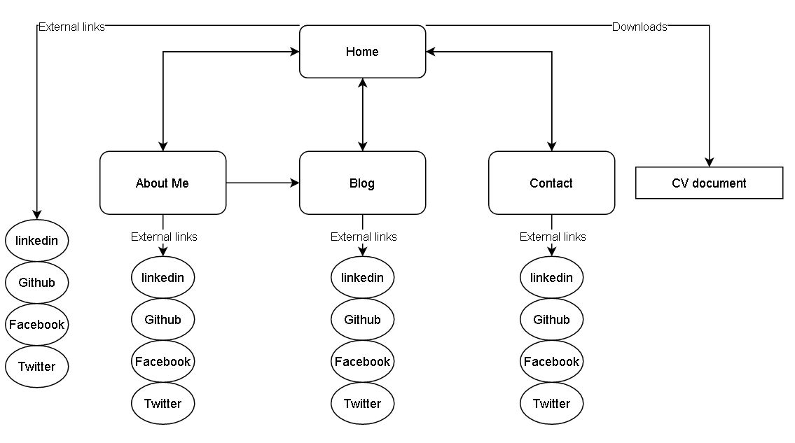
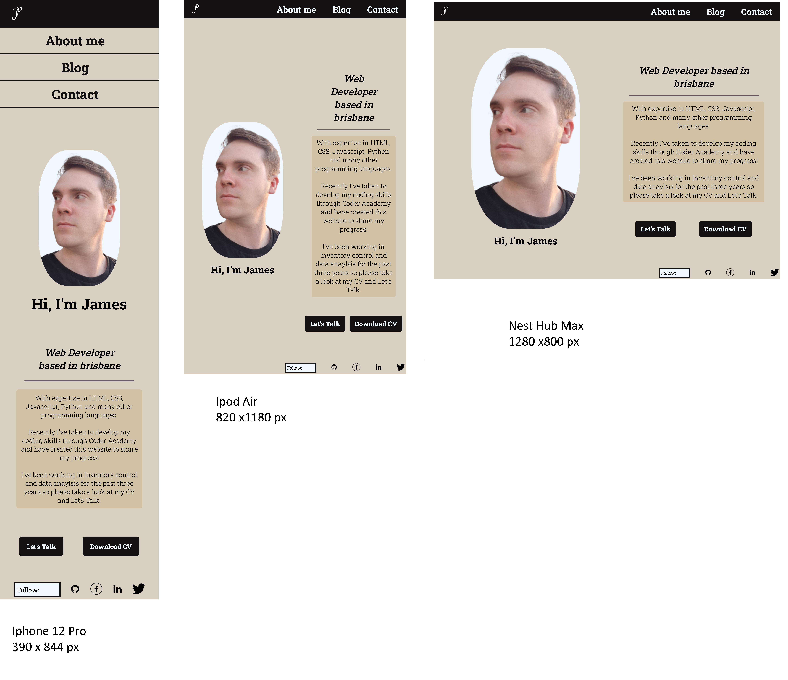
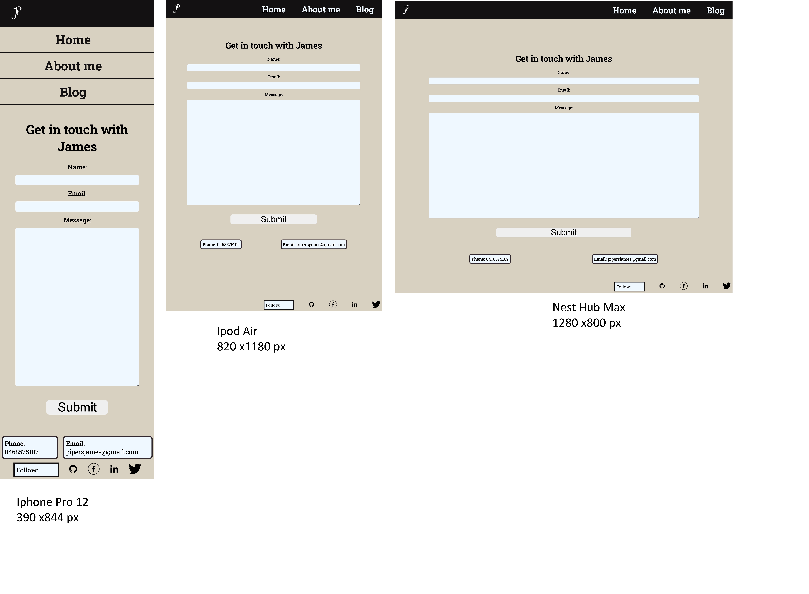

#T1A2 Portfolio Assignment
## 1. URL link

https://lucent-pixie-cb89a3.netlify.app

## 2. Github Repo 

https://github.com/pipersjames/T1A2

## 3. Presentation Video

https://youtu.be/Q3bbFVJBvaM

## 4. Purpose 
This a portfolio website designed to show the skills that I have developed for potential employers to view. It also serves to help employers understand me as a person and look for compatability with their orginization.

## 5. Sitemap

## 6. Screenshots

### Home page

### About me

### Blog

### Contact

## 7. Target audience

* Primarily for - Potential Employers
* Secondary - Friends and Family
* Secondary - Current Work colleagues

note: secondary target audience would be for referral of work or pure enjoyment.

### 8. Tech Stack

* HTML
* CSS
* SCSS
* Github
* netlify
* Balsamiq
* coolors.co
* app.diagrams.net
* Trello.com
* Visual Studio Code

### blog images

Image by Sara Torda from Pixabay  
Image by Dariusz Sankowski from Pixabay
Image by Jan from Pixabay
Image by James Osborne from Pixabay
Image by Memed_Nurrohmad from Pixabay

### Initial visual reference
https://www.wix.com/website-template/view/html/2622?originUrl=https%3A%2F%2Fwww.wix.com%2Fwebsite%2Ftemplates%2Fhtml%2Fportfolio-cv%2Fpersonal&tpClick=view_button&esi=e50d3a2b-4112-455c-ba99-0684a2db2991